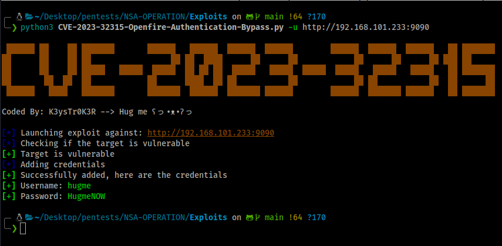

# CVE-2023-32315 - Openfire Authentication Bypass

This repository highlights a high security issue impacting various versions of Openfire. Openfire, a cross-platform real-time collaboration server utilizing the XMPP protocol developed by the Ignite Realtime community, faces a severe vulnerability within its administrative console (Admin Console).

The vulnerability lies within the web-based Admin Console, permitting a path traversal attack through the setup environment. This flaw allows unauthenticated users to access restricted pages intended only for administrative users within an already configured Openfire environment.

While Openfire had path traversal protections, it failed to defend against certain non-standard URL encoding for UTF-16 characters, not supported by the embedded webserver in use at that time. The subsequent upgrade of the embedded webserver introduced support for this non-standard encoding, which the existing path traversal protections did not cover.

Moreover, Openfire's API allowed exclusion of certain URLs from web authentication using wildcard patterns, such as the login page. This combination of wildcard pattern matching and the path traversal vulnerability enabled malicious users to bypass authentication requirements for Admin Console pages.

This vulnerability impacts all Openfire versions released after April 2015, commencing from version 3.10.0. The issue has been patched in releases 4.7.5 and 4.6.8. Further enhancements are slated for the forthcoming version on the 4.8 branch (expected as version 4.8.0).

# The PoC Exploit

# Disclaimer

You are responsible for your own actions, abusing this poc exploit can get you into trouble.
